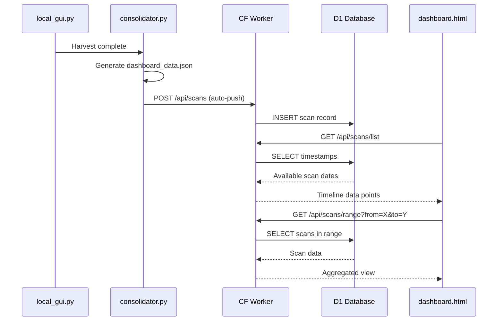

# D1 Cloud Sync with Timeline Slider

## Architecture



## Components

### 1. Cloudflare Worker API (`worker/`)

Create a new `worker/` directory with Wrangler project:

- **`worker/src/index.ts`** - API routes:
  - `POST /api/scans` - Upload scan (auth via simple API key)
  - `GET /api/scans/list` - Return all scan timestamps (for timeline ticks)
  - `GET /api/scans/:id` - Fetch single scan
  - `GET /api/scans/range` - Aggregate scans between two dates

- **`worker/schema.sql`** - D1 schema:
```sql
CREATE TABLE scans (
    id INTEGER PRIMARY KEY AUTOINCREMENT,
    created_at TEXT NOT NULL,
    scan_start TEXT,
    scan_end TEXT,
    thread_count INTEGER,
    flux_score INTEGER,
    grand_metanarrative TEXT,
    data_json TEXT NOT NULL
);
CREATE INDEX idx_created_at ON scans(created_at);
```


### 2. Auto-Push from Consolidator

Modify [`consolidator.py`](consolidator.py):

- Add `push_to_cloud(dashboard_data)` function after `aggregate_dashboard_data()`
- Uses `requests.post()` to Worker API
- Reads API key from `.env` (`AURA_WORKER_KEY`)
- Graceful failure - logs error but doesn't break local flow

### 3. Timeline Slider UI

New file **`js/timeline.js`**:

- Fetch available scans from `/api/scans/list`
- Render dual-handle range slider with:
  - Tick marks at each available scan date
  - Draggable lower/upper bounds
  - Current selection displayed as "Nov 28 - Dec 11"
- On range change, fetch `/api/scans/range` and re-render dashboard

Modify [`dashboard.html`](dashboard.html):

- Add timeline container below header
- Include timeline.js

Modify [`css/dashboard.css`](css/dashboard.css):

- Timeline track styling (matches terminal aesthetic)
- Tick indicators for data points
- Handle styling with glow effects

### 4. Dashboard Data Loading

Modify [`js/app.js`](js/app.js):

- Check for cloud mode vs local mode
- If cloud: fetch from Worker API
- If local (file://): use existing `dashboard_data.js` fallback

## File Changes Summary

| File | Action |

|------|--------|

| `worker/` | New directory - Wrangler project |

| `worker/src/index.ts` | New - Worker API |

| `worker/wrangler.toml` | New - Wrangler config |

| `worker/schema.sql` | New - D1 schema |

| `consolidator.py` | Add cloud push function |

| `.env` | Add `AURA_WORKER_KEY`, `AURA_WORKER_URL` |

| `js/timeline.js` | New - Timeline slider component |

| `js/app.js` | Add cloud/local mode detection |

| `dashboard.html` | Add timeline container |

| `css/dashboard.css` | Add timeline styles |

## Timeline Slider Mockup

```
┌─────────────────────────────────────────────────────────────────┐
│  ◀ Nov 28                    TIMELINE                    Dec 11 ▶ │
│  ──●────●──●───●●●──────●────●──●───●────────[■■■■■■■■]────●──   │
│           ↑                                   ↑─────────↑          │
│     data points                          selected range            │
└─────────────────────────────────────────────────────────────────┘
```